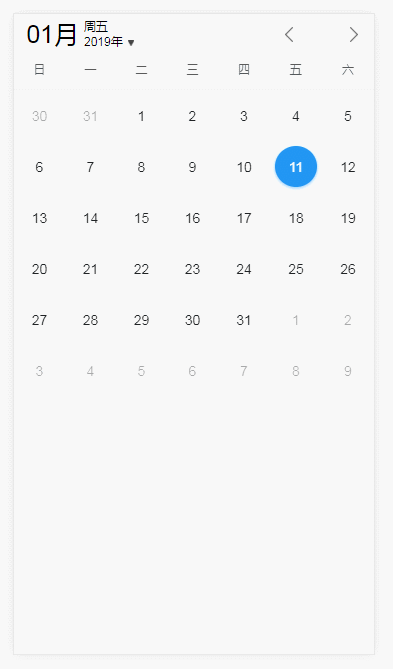

# rm-calendar

> react mobile calendar



## NPM

#### install

`npm install @longlongago2/rm_calendar --save`

#### usage

```
import React, { Component } from 'react';
import RMCalendar from '@longlongago2/rm-calendar';
import '@longlongago2/rm_calendar/dist/rm-calendar.css';

class App extends Component {
  render() {
    return (
      <RMCalendar
          defaultDate={new Date()}
          type="month"
          touch
          width="100%"
          locale="zh-cn"
          firstDayOfWeek={0}
          toolbar
        />
    );
  }
}
```

## CDN

#### download

[rm-calendar.zip (click to download)](https://github.com/longlongago2/rm-calendar/archive/master.zip)

#### usage

```
// css
<link rel="stylesheet" href="[path]/dist/rm-calendar.css">

// js
<script src="[path]/dist/rm-calendar.js"></script>

// html
<RMCalendar.default
    defaultDate={new Date()}
    type="month"
    touch
    width="100%"
    locale="zh-cn"
    firstDayOfWeek={0}
    toolbar
  />
```

## API

#### props
| Props | Description | Type | Default |
| :------ | :------ | :------: | :------: |
| defaultDate | 默认时间 | Date | new Date() |
| type | 日历类型 | "month"\|"week" :String | "month" |
| touch | 是否可滑动 | Boolen | true |
| width | 日历宽度 | String | "100%" |
| locale | 语言区 | String | "zh-cn" |
| firstDayOfWeek | 周起始日[周日-周六] | [0-6] :Integer | 0 |
| schedule | 日程数据 | Array | [] |
| toolbar | 顶部工具栏 | Boolen | true |

#### events

| Events | Description | Usage |
| :------ | :------ | :------: |
| onCellClick | 日期单元格点击事件 | (item) => {} |
| onPageChange | 翻页事件 | ({ year, month }) => {} |

#### methods

| Methods | Description | Params |
| :------ | :------ | :------: |
| turnWeekNumToChar | getDay周数字转汉字 | day :Integer |
| getDaysOfPerMonth | | |
| getDataOfHeader | | |
| getComposeDaysOfBoard | | |
| getDataOfBoard | | |
| getWeekRowOfBoard | | |
| getComputedDataOfBoard | | |
| dateToValid | | |
